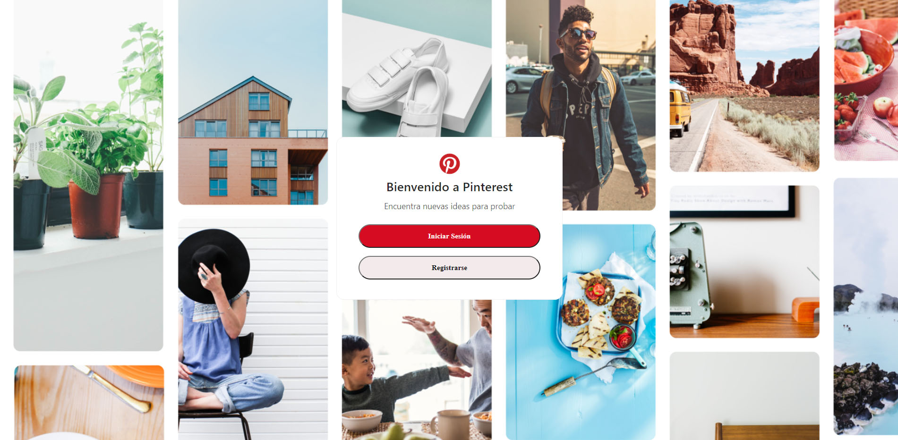
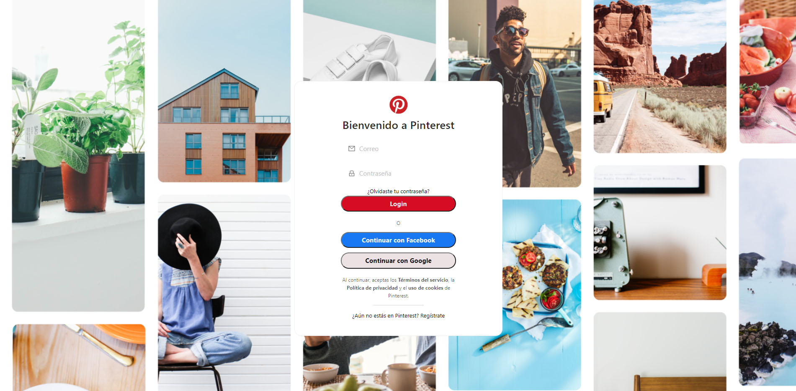
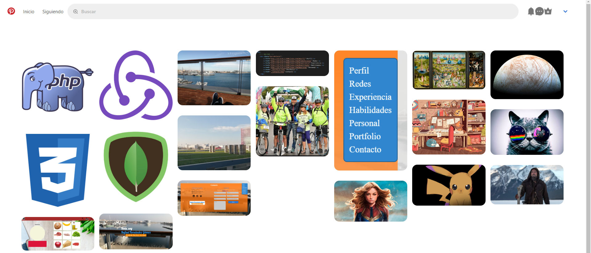
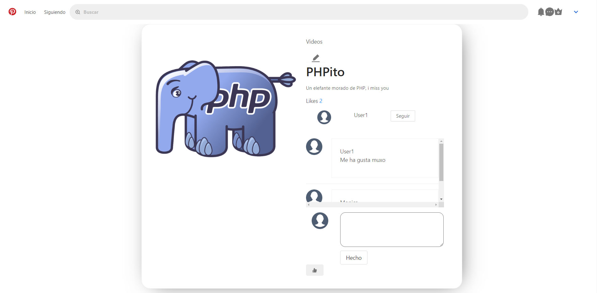
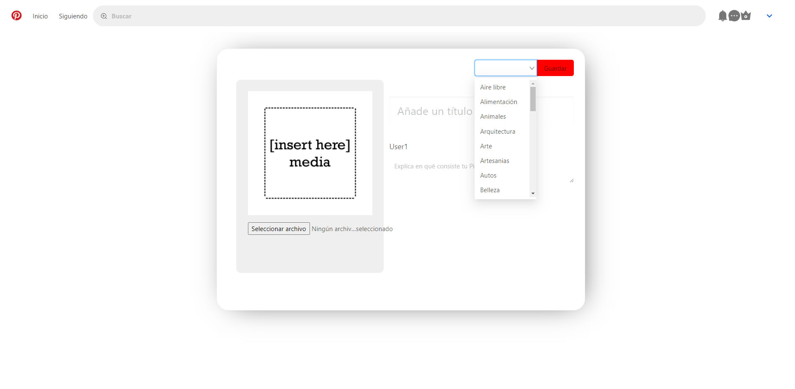

# GH-Proyecto3-RedSocial-Frontend 

FrontEnd del tercer proyecto del Bootcamp FullStack de GeeksHubs de una ecommerce de camisetas.
React(Redux) / Express(MongoDB

## Table of Content

- [Built With](##-Built-With)
- [Knowledge](##-Knowledge)
- [Getting Started](##-Getting-Started)
- [Partes API](##-Partes-API)
- [Documentation](##-Documentation)
- [Author](##-Author)


## Built With 🛠️

* Javascript
* React
* Redux
* Axios
* Ant Design
* Bulma JS

Otros
* Postman
* Trello


## Knowledge 🧠 

* Uso Axios
* Redux


## Getting Started 🚀 

### Clonando repositorio

```js
git clone https://github.com/FerrowRafael/GH-Proyecto2-RedSocial-Frontend
```


### Instalación dependencias

- React
- Redux
- redux-localstorage-simple
- axios
- antd


### Comenzando proyecto React

Utilizamos express-generator para que nos genere una estructura de proyecto a partir de la cual trabajar.

```js
npm install express-generator -g

express --view=pug myapp

cd myapp

npm install

DEBUG=myapp:* npm start
```


### Configuración 

Instalación de dependencia
```js
$ npm install --save-dev sequelize-cli
```

Creando modelo 
```js
npx sequelize-cli model:generate --name User --attributes firstName:string,lastName:string,email:string
```

Migrando modelos a DB
```js
npx sequelize-cli db:migrate
```

Creando semilla
```js
npx sequelize-cli seed:generate --name demo-user
```

Migrando semilla a DB
```js
npx sequelize-cli db:seed:all
```


### Arrancar el servidor

Para arrancar el servidor tienes que introducir el comando:

```js
npm start
```

## Partes API 🗄 #Partes-API

- Components
- Containers
- Guards
- Redux
- App.js


### Components

Los componentes permiten separar la interfaz de usuario en piezas independientes, reutilizables.
Algunos de mis componentes son: 

#### Comments
#### Header
#### Footer
#### SearchBar
#### UpdateProfile
#### ...

Ejemplo: 
```js
ff
```


### Containers

Los containers se corresponde con las vistas de la web
Mis containers son:

#### Detail
#### Home
#### Inicio
#### PinBuilder
#### PinUpdate
#### Profile
#### Results
#### Login
#### Register

Ejemplo: 
```js
ff
```


### Guards

Los Guards nos permiten restringir la entrada a determinadas vistas de nuestra web
Ejemplo:
```js
import React from 'react';
import { Redirect } from 'react-router-dom';

const PrivateZone = ({ children }) => {
  const hasToken = localStorage.getItem('authToken');

  return hasToken ?  children : (
    <Redirect to={{ pathname: '/'}}/>
  );
};

export default PrivateZone;
```


### Redux

Dividida en tres partes:
- Actions
- Reducers
- Store


#### Actions

- Categories
- Comments
- Likes
- Posts
- Users

Ej. store.js
```js
import axios from 'axios';
import store from '../store';

// LOGIN
export const login = async(user) => {
    const res = await axios.post('http://localhost:8000/api/v1/users/login', user);
    localStorage.setItem('authToken', res.data.token); //guardamos el token en localstorage
    
    store.dispatch({ //this.userService.setUser(res.user)
        type: 'LOGIN',
        payload: res.data.user
    });

}

// LOGOUT   
export const logout = async() => {
    const res = await axios.get('http://localhost:8000/api/v1/users/logout', {}, {
        headers: {
            Authorization: localStorage.getItem('authToken')
        }
    })
    localStorage.removeItem('authToken');
    store.dispatch({
        type: 'LOGOUT'
    })
    return res;
}
```


#### Reducers

Usamos combine reducers
- Categories
- Comments
- Likes
- Posts
- Users

Ej. store.js
```js
const posts = (state = {}, action) => {

switch (action.type) {
    // POSTS ALL
    case 'POSTS_ALL':
        return {
            ...state,
            posts: action.payload
        } 
    case 'POST_DETAIL':
        return {
            ...state,
            postDetail: action.payload
        } 
    case 'SEARCH_RESULT':
        return {
            ...state,
            result: action.payload
            }
    case 'SEARCH_NAME':
        return {
            ...state,
            postSearchResult: action.payload
        }
    case 'UPDATE_POST':
        return {
            ...state,
            postSearchResult: action.payload
        } 
    case 'DELETE_POST':
        return {
            ...state,
            postSearchResult: []
            }     
    default:
        return state

    }
    
}
export default posts;
```


#### Store

Ej. store.js
```js
import { createStore, compose, applyMiddleware } from "redux";
import reducer from "../redux/reducers/index";
import { save, load } from "redux-localstorage-simple";
const composeEnhancers =
    window.__REDUX_DEVTOOLS_EXTENSION_COMPOSE__ || compose;

const createStoreWithMiddleware = applyMiddleware(
    save(), // Saving done here
)(createStore);

const store = createStoreWithMiddleware(
    reducer,
    load({preloadedState:{comments_post:[], likes_post:[], postDetail:[]}}), // Loading done here
    composeEnhancers(),
);

export default store;
```


## Documentation 📚 

- [React](https://es.reactjs.org/)
- [Redux](https://redux.js.org/)
- [Ant Design](https://ant.design/)
- [Bulma](https://bulma.io/)


## Author 👨🏼‍💻 

* **Rafael Fernández Gómez** - [FerrowRafael](https://github.com/FerrowRafael)


## Vistas Web 

Inicio
<a href="https://github.com/FerrowRafael/GH-Proyecto2-RedSocial-Frontend"></a>

Register/Login
<a href="https://github.com/FerrowRafael/GH-Proyecto2-RedSocial-Frontend"></a>

Home
<a href="https://github.com/FerrowRafael/GH-Proyecto2-RedSocial-Frontend"></a>

Detail
<a href="https://github.com/FerrowRafael/GH-Proyecto2-RedSocial-Frontend"></a>

Create Post
<a href="https://github.com/FerrowRafael/GH-Proyecto2-RedSocial-Frontend"></a>
